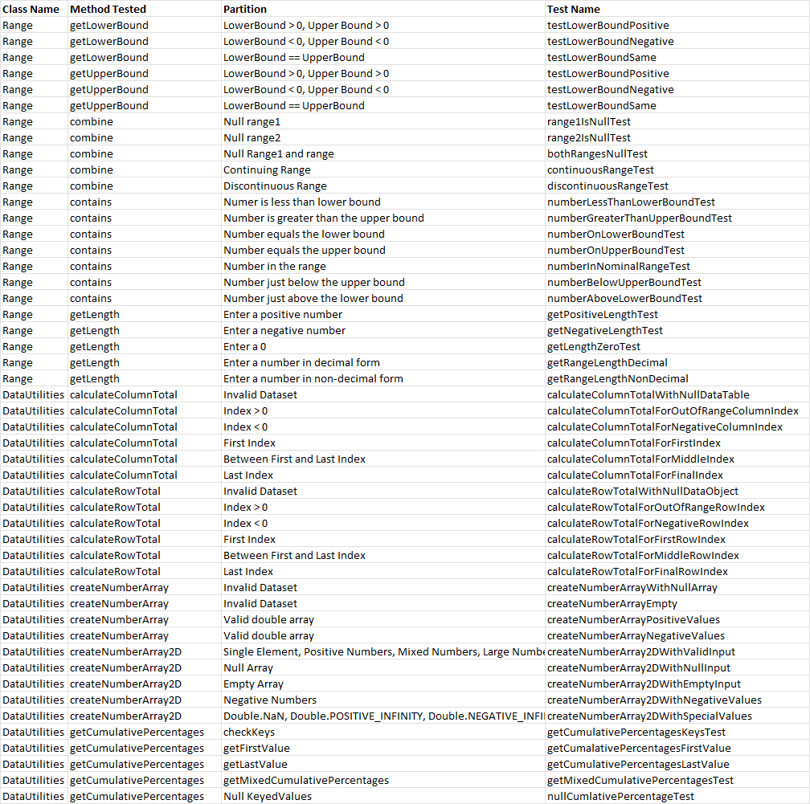

**SENG 438 - Software Testing, Reliability, and Quality**

**Lab. Report \#2 – Requirements-Based Test Generation**

| Group \#:      |               |
| -------------- |---------------|
| Student Names: | Nour Ajami    |
|                | Mohamed Amara |
|                | Krishna Shah  |
|                | Zuhaer Rahman |

# 1 Introduction

The purpose of this lab is to familiarize and introduce us to the principles of black box testing through automated unit testing focusing on specific requirements for each component of the System Under Test (SUT). We will be using Junit framework with mock objects during the testing. We will write tests for methods of Range and DataUtilities classes with respect to their specifications as mentioned in the documentation.
# 2 Detailed description of unit test strategy

We began our approach by examining the Java documentation to thoroughly comprehend the functionalities of the Range and DataUtilities methods. Subsequently, we employed two black box design strategies: equivalence class testing and boundary value testing. In equivalence class testing, we categorized the classes for each method according to the anticipated responses to valid and invalid inputs for that method. Afterward, we implemented boundary value testing on relevant unit tests by identifying and using their minimum and maximum values as test inputs. As instructed, we constructed and chose 5 methods to test for each one of the classes (10 methods total), whilst 3 beings mocks for the DataUtilities class. 
### **Input Partitions: Range Class Methods**

#### **`combine(Range range 1, Range range2)`**
1. **Null range1**
   - range1 is null (Valid)
   - range2 is not null (Valid)
2. **Null range2**
   - range1 is not null (Valid)
   - range2 is null (Valid)
3. **Null range1 and range2**
   - range1 is null (Valid)
   - range2 is null (Valid)
4. **Overlapping / Continuing Range (Should return their combined ranges)**
   - range1 (0,4) (Valid)
   - range2 (4,8) (Valid)
5. **Non-Overlapping / Discontinuous Range (Should return combined ranges, and range that is not covered by neither one)**
   - range1 (0,5) (Valid)
   - range2 (8,15) (Valid)
   
#### `contains(double value)`
1. **Number is less than lower bound (Valid)**
2. **Number is greater than the upper bound (Valid)**
3. **Number equals the lower bound (Valid)**
4. **Number equals the upper bound (Valid)**
5. **Number in the range**
6. **Number just below the upper bound**
7. **Number just above the lower bound**

#### `getLength()`
1. **Enter a positive number (Valid)**
2. **Enter a negative number (Valid)**
3. **Enter a 0 (Valid)**
4. **Enter a number in decimal form (Valid)**
5. **Enter a number in non-decimal form (Valid)**

`getUpperBound()`
1. **Positive Range**
   - lower bound: 2
   - upper bound: 4
2. **Negative Range**
   - lower bound: -4
   - upper bound: -2
3. **Same Lower and Upper Bound**
   - lower bound: 2
   - upper bound: 2
   
`getLowerBound()`
1. **Positive Range**
   - lower bound: 2
   - upper bound: 4
2. **Negative Range**
   - lower bound: -4
   - upper bound: -2
3. **Same Lower and Upper Bound**
   - lower bound: 2
   - upper bound: 2

### **Input Partitions: DataUtilities Class Methods**

`getCumulativePercentagesKeysTest`

1. Null KeyedValues (invalid)
2. getFirstValue (valid)
3. getLastValue (valid)
4. checkKeys (valid)
5. getMixedCumulativePercentages (valid)

`CalculateColumnTotalTest`
1. Invalid dataset
2. Index < 0
3. First Index
4. Indexes between the first index and last index
5. Last Index
6. Index > # of columns - 1

`CalculateRowTotalTest`
1. Invalid dataset
2. Index < 0
3. First Index
4. Indexes between the first index and last index
5. Last Index
6. Index > # of columns - 1

`CreateNumberArrayTest`
1. Invalid double array
2. Empty Array
3. Valid double array

`createNumberArray2D`

#### Valid Data Arrays

1. Empty Array: data = new double[0][0];
   - Expected: Number[][]{} (an empty Number array).
2. Single Element Array: data = new double[][]{{5.0}};
   - Expected: Number[][]{{5.0}} (a Number array with a single element).
3. Positive Numbers: data = new double[][]{{1.0, 2.0}, {3.0, 4.0}};
   - Expected: Number[][]{{1.0, 2.0}, {3.0, 4.0}} (a Number array with positive numbers).
4. Negative Numbers: data = new double[][]{{-1.0, -2.0}, {-3.0, -4.0}};
   - Expected: Number[][]{{-1.0, -2.0}, {-3.0, -4.0}} (a Number array with negative numbers).
5. Mixed Numbers: data = new double[][]{{-1.0, 2.0}, {0.0, -4.0}};
   - Expected: Number[][]{{-1.0, 2.0}, {0.0, -4.0}} (a Number array with mixed values).
6. Large Numbers: data = new double[][]{{Double.MAX_VALUE, -Double.MAX_VALUE}};
   - Expected: Number[][]{{Double.MAX_VALUE, -Double.MAX_VALUE}} (a Number array with large values).
   
#### Special Value Arrays

7. Containing Double.NaN: data = new double[][]{{Double.NaN, 1.0}};
   - Expected: Number[][]{{Double.NaN, 1.0}} (a Number array containing NaN).
8. Containing Double.POSITIVE_INFINITY: data = new double[][]{{Double.POSITIVE_INFINITY, -1.0}};
   - Expected: Number[][]{{Double.POSITIVE_INFINITY, -1.0}} (a Number array containing positive infinity).
9. Containing Double.NEGATIVE_INFINITY: data = new double[][]{{Double.NEGATIVE_INFINITY, 1.0}};
   - Expected: Number[][]{{Double.NEGATIVE_INFINITY, 1.0}} (a Number array containing negative infinity).

#### Invalid Data Array

10. Array: data = null;
    - Expected: InvalidParameterException (an exception is thrown due to null input).

# 3 Test cases developed

# 4 How the team work/effort was divided and managed

To divide the work for this lab, our group split into two pairs again (Mohamed and Nour & Krishna and Zuhaer) to create test cases for both the Range and DataUtilities classes. One pair wrote test cases for 5 methods in the Range class while the other pair wrote test cases for 5 methods in the DataUtilities class. We then got on a discord call to review each-others work, discuss any discrepancies, and ensured everyone is able to write test cases using mock objects. Overall, pair programming has been a technique that our group strongly values and has proven to be a success in ensuring everyone achieves the objectives of this assignment.

# 5 Difficulties encountered, challenges overcome, and lessons learned

Our group faced many difficulties and challenges throughout the lab that were necessary to go through in order to reach the objectives of the lab. Some of the difficulties we encountered include setting up our IDE, ensuring the JAVA SE version we have installed is compatible with JUnit 4.1.1, and not knowing how the inherited classes function for the DataUtilities class. To overcome these challenges, we first tried to set up our testing environment using IntelliJ and VSCode but weren't successful in being able to run any of the jar files or test cases. To fix this, we resorted to using Eclipse where we didn't encounter any problems with test case creation or running any files. Moreover, we ensured that we were using JavaSE version 1.8 and jdk version 17.0.1 in order to run JUnit tests without any issues. Lastly, we utilized Mocking to test most of the methods for the DataUtilities class in order to return the values and throw the exceptions we wanted. While this is a great way to test interfaces, the drawback to this is it can cause inconsistencies or introduce errors between our test cases. This can eventually lead to false positives or false negatives as a result. The most valuable lessons learned from the group include being able to write enhanced test cases that achieve broad test coverage, setting up a test environment from scratch, and understanding how to ensure that the software functions as intended in real-world scenarios.

# 6 Comments/feedback on the lab itself

 We believe that this lab was quite a good introduction to black-box testing and applying the techniques such as equivalence classes and boundary value testing. The incorporation of mocks to simulate methods behaviours was quite insightful, offering us experience in dealing with dependencies in a testing environment. It was fantastic to see how to actually setup eclipse environment up and running in order to get started with the unit tests. We believe it would also have been beneficial to see how to set up this environment in order IDE's such as Intellij or VScode as well. Overall, it was a great way to get started with automated testing using Junit and was quite insightful providing us a solid foundation in software testing.  
